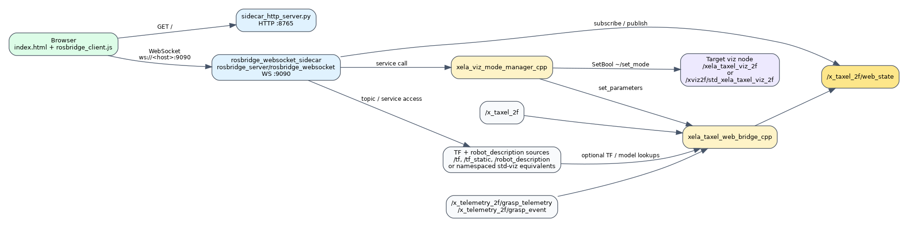

# Design
# xela_taxel_sidecar_2f

## 1. Overview and design objective
The 2F sidecar is designed as a non-invasive visualization adapter: it does not alter upstream tactile publishers or downstream control logic.

Design intent:
- transform ROS tactile payloads into browser-consumable state with low integration cost
- expose runtime mode switching as a stable ROS service contract
- support both global and namespaced TF transport models through launch remapping

This keeps web visualization evolvable independently of control-stack release cycles.

## 2. Node architecture
### 2.1 Bridge node (`xela_taxel_web_bridge_node`)
- subscribes tactile array topic
- optionally subscribes grasp telemetry/event topics and embeds recent JSON metadata
- normalizes and maps taxel values
- publishes compact JSON payload
- optional TF lookups for URDF points when enabled

### 2.2 Mode manager (`xela_viz_mode_manager_node`)
- service facade at `/xela_viz_mode_manager/set_mode`
- writes bridge params: `viz_mode`, `emit_urdf_points`, `freeze_urdf_positions`
- forwards mode request to target viz node service
- startup sync timer retries until bridge/viz services are reachable

### 2.3 Web transport
- static HTTP server serves `web/taxel_sidecar`
- optional dedicated rosbridge instance for sidecar websocket traffic
- browser websocket fallback order: `:9090`, `:3201`, `/ros`

### 2.4 Web UI runtime
- browser-side display modes are `GridMode`, `XelaModel`, and `RobotModel`
- `GridMode/XelaModel/RobotModel` are client-side view choices and are distinct from ROS-side `grid/urdf`
- RobotModel includes optional FollowCam logic and telemetry analysis rendering
- FollowCam / Analysis toolbar exposure can be toggled independently from the underlying code paths

#### 2.4.1 FollowCam detailed design
- Scope:
  - available only when the UI is in `RobotModel`
  - acts as a client-side camera controller and does not modify ROS-side visualization mode
- Activation:
  - toggled by the `FollowCam` toolbar button
  - when enabled, FollowCam resets its filtered state and performs a one-shot snap to the first resolved camera goal
  - when disabled, RobotModel returns to normal fixed orbit framing
- Frame resolution policy:
  - anchor priority chain: `grasp_link -> robotiq_base_link -> tool0 -> base_link`
  - left tip priority chain: `left_inner_finger -> left_outer_finger -> left_inner_finger_pad -> x_base_01_uSPr2F_link`
  - right tip priority chain: `right_inner_finger -> right_outer_finger -> right_inner_finger_pad -> x_base_02_uSPr2F_link`
  - if tip frames are missing, the camera falls back to an anchor-forward estimate
- Camera placement policy:
  - target base is the midpoint of left/right tip frames when both are available
  - camera direction is reconstructed from fingertip geometry (`tip span x finger axis`) and protected against hemisphere flips
  - final camera goal is placed at `targetBase + forward * forwardDistance + worldUp * heightOffset`
  - final look target is `targetBase - forward * lookAhead + worldUp * lookUp`
- Motion policy:
  - uses filtered anchor position, filtered target base, and filtered forward vector
  - uses lerp-based smoothing plus per-frame max step limits for camera and target
  - rejects one-shot TF jumps and re-syncs after repeated jump rejects
- Manual override policy:
  - if the user manually orbits in `RobotModel`, FollowCam pauses for `3s`
  - after the pause window expires, automatic follow resumes
- Diagnostics:
  - `followDebug` displays resolved anchor/tip frames, source branch, raw vector, filtered vector, and sign
  - debug output is throttled to avoid excessive DOM churn

#### 2.4.2 Analysis detailed design
- Scope:
  - a client-side analysis panel for tactile/grasp telemetry inspection
  - independent of ROS-side `grid/urdf` mode; it operates on the currently received sidecar payload
- UI surface:
  - controlled by the `Analysis` toolbar button
  - shows or hides `statsRow`, including the summary text, current-value strip, contact badge, sparkline, and event tooltip
- Data sources:
  - uses the current sidecar payload (`/x_taxel_2f/web_state`)
  - reads `meta.grasp`, `meta.grasp_event`, and derived current force values from the payload
- Timeline model:
  - keeps a rolling window (`10s`, `30s`, `60s`) of sampled telemetry points
  - supports pause/resume without dropping the already collected history
  - stores discrete event markers separately from continuous samples
- Render policy:
  - periodically recomputes summary text (`age`, active mode, force/sigma/phase/event fields)
  - draws a sparkline for recent history
  - overlays event markers and exposes hover tooltip inspection
  - updates the contact badge when new events indicate sparse/broad/slip-related contact conditions
- Intended use:
  - operator/debug visibility for grasp phase changes
  - quick inspection of force trends, event timing, and slip/contact transitions
  - complements, but does not replace, external logging or ROS topic introspection

Analysis panel display items:

| UI element | Primary source | Purpose |
| --- | --- | --- |
| `statsText` | current payload + derived summary | Top-level summary line showing age, active UI mode, source, force/sigma/phase/event fields |
| `statsCurrent` | current payload (`meta.grasp`, grid Fz rollup) | Current-value strip for `fz_total`, left/right force, sigma peak, and phase |
| `contactBadge` | registered grasp events | Short-lived badge for sparse, broad, or slip-related contact conditions |
| `sparkline` | sampled timeline points | Rolling history visualization over the selected `10s / 30s / 60s` window |
| event markers | `meta.grasp_event` | Discrete event points overlaid on the sparkline timeline |
| event tooltip | nearest event under hover | Detailed event inspection on mouse hover |
| window buttons (`10s`, `30s`, `60s`) | client-side timeline state | Changes the retained/rendered history window |
| `Pause` | client-side timeline state | Freezes timeline advancement without discarding collected samples |

FollowCam tuning contract:

| Query parameter | Meaning | Current built-in baseline |
| --- | --- | --- |
| `follow_cam_forward_distance` | Forward camera offset from the resolved fingertip target | `-0.2` |
| `follow_cam_height_offset` | Height offset above the target in world Z | `0.1` |
| `follow_cam_look_ahead` | Backward look offset toward the sensor area | `0.028` |
| `follow_cam_forward_sign` | Hemisphere flip for the resolved forward vector | `-1.0` |

There is no separate `follow_cam_profile` selector in the current implementation; the effective preset is the combination of these `follow_cam_*` query values.

### 2.5 Runtime wiring diagram

Regeneration source: `docs/runtime_wiring_diagram.dot`

Notes:
- The browser gets static assets over HTTP (`8765`) and ROS data over WebSocket (`9090`) through two separate servers.
- `rosbridge_client.js` connects to `:9090` first; `:3201` and `/ros` are fallback endpoints when the sidecar-local rosbridge is disabled or unavailable.
- `xela_viz_mode_manager_cpp` is the ROS-facing mode switch facade; the browser does not talk directly to the bridge node for mode changes.

## 3. Launch architecture
`xela_taxel_sidecar_cpp.launch.py` is primary launch path.
`xela_taxel_sidecar.launch.py` keeps Python bridge compatibility path.
The primary launch also exposes explicit network bind arguments for the static web server and the optional sidecar rosbridge (`web_host`, `sidecar_rosbridge_host`, default `0.0.0.0`).

## 4. Integration strategy
- default target `viz_node_name=/xela_taxel_viz_2f`
- std-viz namespaced target is provided by launch override:
  - `viz_node_name:=/xviz2f/std_xela_taxel_viz_2f`
  - `bridge_tf_topic:=/xviz2f/tf`
  - `bridge_tf_static_topic:=/xviz2f/tf_static`

## 5. Design risks
- stale mode if target viz service unavailable
- TF remap mismatch in URDF mode
- duplicate transport nodes when both launch variants are started

## 6. Validation
- launch smoke test
- topic publish-rate observation
- service toggle test
- web render check on sidecar URL
- browser websocket fallback check (`9090 -> 3201 -> /ros`)
- verify URL query defaults are used when no `follow_cam_*` overrides are present

## 7. Telemetry roadmap notes
- implemented baseline for objective-wide event stream:
  - `phase_changed`, `contact_detected`, `no_contact_full_close`, `slip_warning`
- implemented scalar motion metric:
  - `/x_telemetry_2f/grasp_metric/gripper_vel` (command-side velocity estimate)
- deferred to design backlog:
  - side-specific force split (`fz_left`, `fz_right`)
  - left/right contact symmetry and area-comparison metrics
  - material-aware slip scoring beyond single-threshold shear delta
